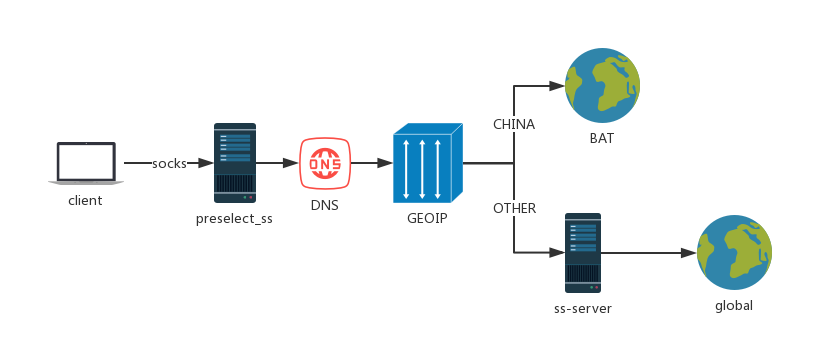

# Preselect_ss

[](https://travis-ci.org/joemccann/dillinger)

[preselect_ss](https://github.com/Nrehearsal/preselect_ss) is a global proxy,which proxy and forward socks5 packets according to DNS and GEOIP，used to prevent DNS pollution and privacy leaks.

  - base on shadowsocks, buf completely re-implemented the ss-server
  - use ipip.net‘s database for IP address location
  - only support ipv4
  - informal version，use at your own risk

### Implementation details

### Installation

- centos
    ```sh
    $ yum install json-c-devel.x86_64 libsodium13-devel.x86_64 mbedtls-devel.x86_64
    $ git clone https://github.com/Nrehearsal/preselect_ss.git
    $ ./build.sh
    $ ./preselect_ss -p 8081 -k mypassword -m aes-128-gcm -t 60 -u x.x.x.x -l 3389 -d ipipfree.ipdb -n 119.29.29.29
    ```
- ubuntu
    ```sh
    $ apt-get install libjson-c-dev libsodium-dev libmbedtls-dev
    $ git clone https://github.com/Nrehearsal/preselect_ss.git
    $ ./build.sh
    $ ./preselect_ss -p 8081 -k mypassword -m aes-128-gcm -t 60 -u x.x.x.x -l 3389 -d ipipfree.ipdb -n 119.29.29.29
    ```
- tips: 
    - -c <conf> configuration file for preselect_ss
    - -p <port> port for your ss server
    - -k <password> password for your ss server
    - -m <method> encrypt method for you ss server
    - -t <timeout> proxy timeout
    - -u <uhost> upstream host
    - -l <uport> upstream port
    - -d <ipdb> ipdb file
    - -n <nameserver> dns nameserver

